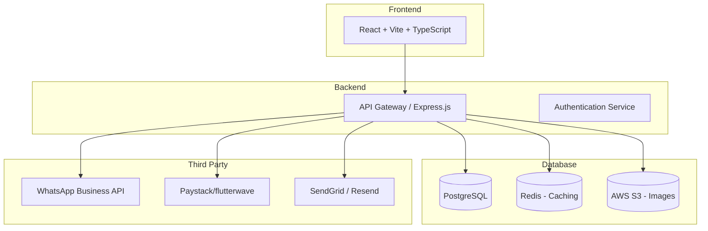
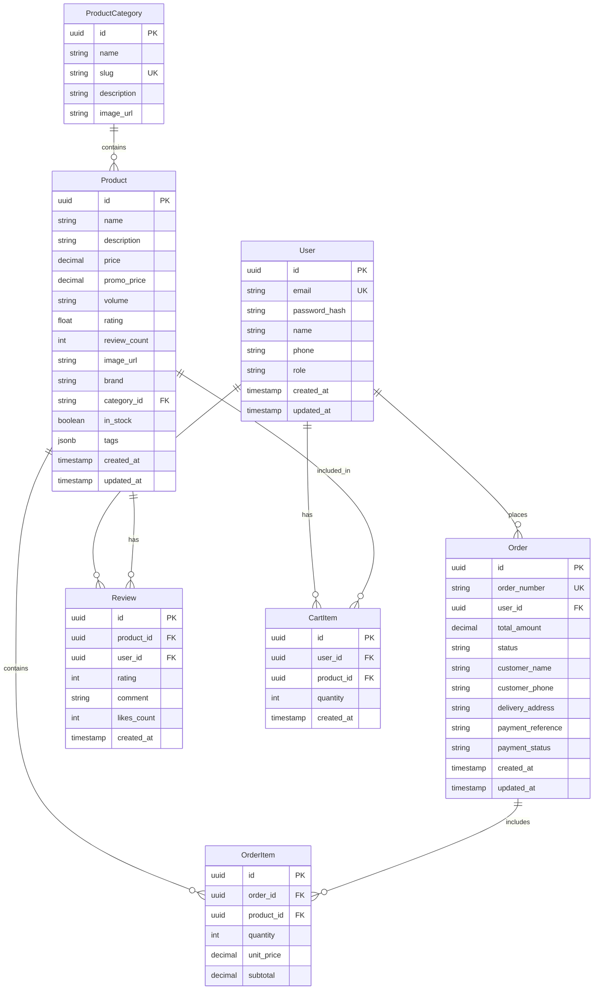
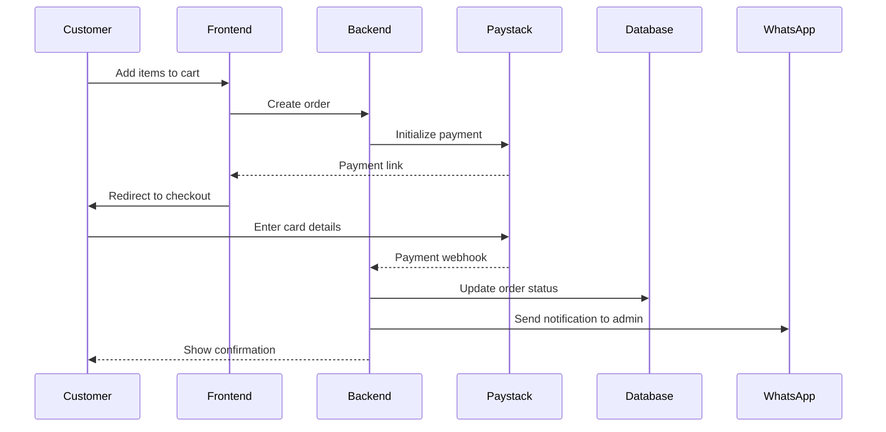
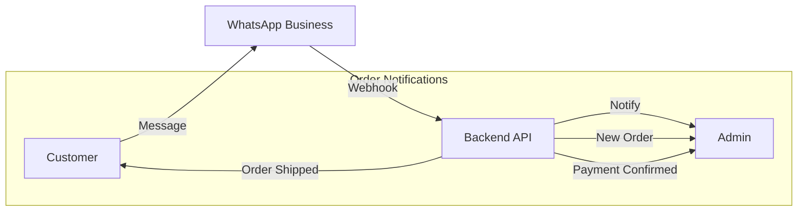

# ADEDAS MULTIBUSINESS - Full Stack Architecture

## Executive Summary

ADEDAS MULTIBUSINESS is a beauty and lifestyle e-commerce platform built with a modern frontend stack (React + Vite) that requires a robust backend to support real-time order management, product catalog management, customer reviews, and payment integration.

---

## 1. Technology Stack Recommendation

### Frontend (Current)
- **Framework**: React 18 + TypeScript
- **Build Tool**: Vite
- **Styling**: Tailwind CSS + Shadcn/UI
- **State Management**: React Context + React Query
- **Animations**: Framer Motion

### Recommended Backend Stack



### Backend Technology Options

| Option | Technology | Best For |
|--------|------------|----------|
| **Option A** | Node.js + Express + Prisma | Quick prototyping, JavaScript consistency |
| **Option B** | Next.js (Full-stack) | Server-side rendering, SEO optimization |
| **Option C** | Bun + Hono | High performance, modern runtime |

**Recommendation**: **Option B - Next.js** with App Router for better SEO and unified frontend/backend development.

---

## 2. Database Schema Design

### Database: PostgreSQL (via Prisma ORM)



---

## 3. API Endpoints Design

### Authentication
```
POST   /api/auth/register     - Register new user
POST   /api/auth/login        - User login
POST   /api/auth/logout      - User logout
GET    /api/auth/me           - Get current user
POST   /api/auth/forgot      - Password reset request
POST   /api/auth/reset       - Password reset
```

### Products
```
GET    /api/products                   - List all products (with pagination, filters)
GET    /api/products/:id              - Get product details
POST   /api/products                  - Create product (Admin)
PUT    /api/products/:id              - Update product (Admin)
DELETE /api/products/:id              - Delete product (Admin)
GET    /api/products/featured         - Get featured products
GET    /api/products/search           - Search products
```

### Categories
```
GET    /api/categories                - List all categories
GET    /api/categories/:slug          - Get category by slug
POST   /api/categories                - Create category (Admin)
PUT    /api/categories/:id            - Update category (Admin)
DELETE /api/categories/:id            - Delete category (Admin)
```

### Orders
```
GET    /api/orders                    - List user orders
GET    /api/orders/:id                - Get order details
POST   /api/orders                    - Create new order
PUT    /api/orders/:id/status         - Update order status (Admin)
GET    /api/orders/admin              - All orders (Admin)
```

### Cart
```
GET    /api/cart                      - Get user's cart
POST   /api/cart/items                - Add item to cart
PUT    /api/cart/items/:id            - Update cart item quantity
DELETE /api/cart/items/:id            - Remove item from cart
DELETE /api/cart                      - Clear cart
```

### Reviews
```
GET    /api/products/:id/reviews      - Get product reviews
POST   /api/products/:id/reviews      - Add review
PUT    /api/reviews/:id               - Update review
DELETE /api/reviews/:id               - Delete review
POST   /api/reviews/:id/like           - Like a review
```

### Payments
```
POST   /api/payments/initialize       - Initialize payment
POST   /api/payments/verify            - Verify payment callback
GET    /api/payments/:orderId          - Get payment status
```

### Contact
```
POST   /api/contact                    - Submit contact form
GET    /api/admin/contacts             - View all contacts (Admin)
```

---

## 4. Payment Integration Flow



### Payment Account Configuration
```
Bank: First Bank
Account Number: 3046110946
Account Name: Adedamola Olayemi Daramola
```

---

## 5. WhatsApp Integration



### WhatsApp Message Templates
- New order notification to admin
- Order confirmation to customer
- Shipping updates to customer

---

## 6. File Structure (Recommended)

```
honey-gold-store/
├── frontend/                    # Current React app
│   ├── src/
│   └── ...
│
├── backend/                     # New backend (Next.js)
│   ├── src/
│   │   ├── app/
│   │   │   ├── (api)/
│   │   │   │   ├── auth/
│   │   │   │   ├── products/
│   │   │   │   ├── orders/
│   │   │   │   ├── cart/
│   │   │   │   ├── reviews/
│   │   │   │   ├── payments/
│   │   │   │   └── contact/
│   │   │   ├── layout.tsx
│   │   │   └── page.tsx
│   │   ├── components/
│   │   ├── lib/
│   │   │   ├── prisma.ts      # Database client
│   │   │   ├── auth.ts        # Auth utilities
│   │   │   └── whatsapp.ts    # WhatsApp client
│   │   └── types/
│   ├── prisma/
│   │   └── schema.prisma      # Database schema
│   ├── .env.example
│   └── package.json
│
└── README.md
```

---

## 7. Implementation Phases

### Phase 1: Backend Setup (Week 1-2)
- [ ] Set up Next.js project
- [ ] Configure PostgreSQL database
- [ ] Set up Prisma ORM
- [ ] Create database migrations
- [ ] Implement authentication

### Phase 2: Core Features (Week 3-4)
- [ ] Product CRUD operations
- [ ] Category management
- [ ] Cart functionality
- [ ] Order management

### Phase 3: Payment & Reviews (Week 5-6)
- [ ] Paystack integration
- [ ] Review and rating system
- [ ] WhatsApp notifications

### Phase 4: Polish & Deploy (Week 7-8)
- [ ] Admin dashboard enhancements
- [ ] Performance optimization
- [ ] Deploy to Vercel + Railway/Supabase

---

## 8. Environment Variables Required

```env
# Database
DATABASE_URL="postgresql://..."

# Authentication
JWT_SECRET="your-jwt-secret"
NEXTAUTH_SECRET="your-nextauth-secret"

# Payment
PAYSTACK_SECRET_KEY="sk_test_..."
PAYSTACK_PUBLIC_KEY="pk_test_..."

# WhatsApp
WHATSAPP_BUSINESS_ID="..."
WHATSAPP_ACCESS_TOKEN="..."
WHATSAPP_ADMIN_PHONE="+2348036262488"

# Storage
AWS_ACCESS_KEY_ID="..."
AWS_SECRET_ACCESS_KEY="..."
AWS_BUCKET_NAME="adedas-images"
AWS_REGION="eu-west-1"

# Email
SENDGRID_API_KEY="SG...."
FROM_EMAIL="noreply@adedas.com"

# App
NEXT_PUBLIC_APP_URL="https://adedas.com"
```

---

## 9. Current Frontend → Backend Mapping

| Current Feature | Backend Endpoint |
|-----------------|------------------|
| Product list | `GET /api/products` |
| Product detail | `GET /api/products/:id` |
| Add to cart | `POST /api/cart/items` |
| Checkout | `POST /api/orders` + `POST /api/payments/initialize` |
| Submit review | `POST /api/products/:id/reviews` |
| Like review | `POST /api/reviews/:id/like` |
| Contact form | `POST /api/contact` |
| Admin products | `GET/POST/PUT/DELETE /api/products` |
| Admin orders | `GET/PUT /api/orders/admin` |

---

## 10. Summary

This architecture provides:

1. **Scalable Database**: PostgreSQL with proper relationships
2. **RESTful API**: Clean endpoint design
3. **Payment Integration**: Paystack for Nigerian payments
4. **Notifications**: WhatsApp Business API for order updates
5. **Admin Panel**: Full CRUD for products, orders, categories
6. **User Features**: Authentication, reviews, ratings, cart

The recommended approach is to migrate to **Next.js** which will handle both the API routes and provide better SEO for the e-commerce site.
